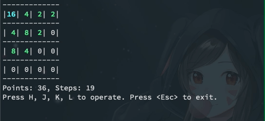
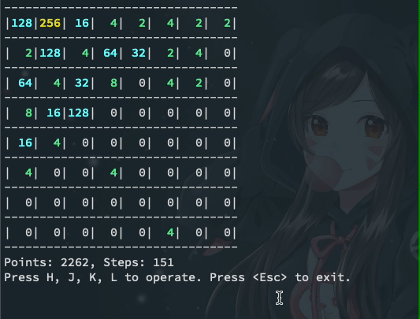
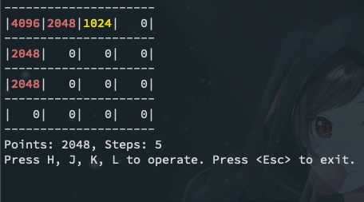

# 2048 Game in terminal

Now only support `Linux` and `Mac`.

You can use this game to practice `hjkl` operations in the vim editor.

## Install

```bash
$ go install github.com/fioncat/ter2048@latest
$ ter2048  # Start game
```

## Screenshot

**Normal size**



**Big Size**

```bash
$ ter2048 --size 8 --grow 2
```



**Big Number**

```bash
$ ter2048 --options 1024 --options 2048
```



You can try more options, see `ter2048 -h`.
